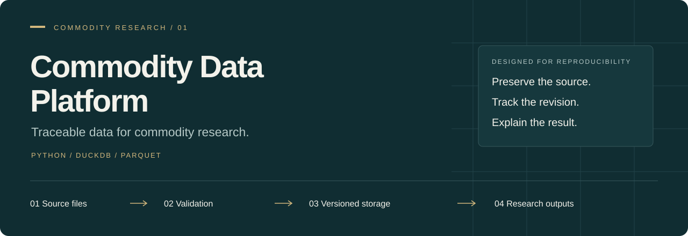
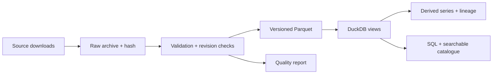

<p align="center">
  
</p>

<p align="center">
  <a href="https://github.com/ambekarhrush/commodity-data-platform/actions/workflows/ci.yml"></a>
  <a href="https://github.com/ambekarhrush/commodity-data-platform/actions/workflows/daily.yml"></a>
</p>

<p align="center">
  <a href="#why-this-project">Purpose</a> ·
  <a href="#what-it-delivers">Capabilities</a> ·
  <a href="#run-it-locally">Quick start</a> ·
  <a href="docs/REFERENCE.md">Engineering reference</a> ·
  <a href="docs/COMPLETION.md">Validation status</a>
</p>

## Why this project

Commodity research starts with a deceptively difficult task: making prices,
inventories and positioning data comparable, traceable and reproducible.
Sources arrive on different schedules, historical values can change, and a spot
benchmark can easily be mistaken for a tradable futures price.

**Commodity Data Platform provides the shared data foundation for a commodity
research and risk workflow.** It archives source files, validates observations,
retains retrieval vintages and exposes a consistent SQL interface through DuckDB
and Parquet. Every derived series records the input snapshots behind it.

Built in Python. Designed for a small research desk. Project 01 of a five-part
[commodity research portfolio](docs/ROADMAP.md).

## What it delivers

| Capability | Research value |
| :--- | :--- |
| **Traceable observations** | Follow a value back to its source file, retrieval time and SHA-256 hash. |
| **Revision history** | Compare downloads and query earlier retrieval snapshots when providers revise history. |
| **Explicit quality controls** | Reject structural failures; surface stale data, gaps and unusual moves for review. |
| **Derived commodity measures** | Inspect LME cash–three-month spreads, relative curve slopes and an indicative spot crack spread. |
| **Futures roll mechanics** | Separate the held contract’s price change from the price gap at a roll. |
| **Research access** | Query with SQL, browse a searchable catalogue, and export checksummed backups. |

### Evidence at a glance

| Source observations | Derived observations | Derived series | Source adapters¹ |
| :--- | :--- | :--- | :--- |
| **224,844** | **37,747** | **14** | **7** |

Local snapshot verified on **7 October 2026**. Counts describe stored coverage;
they do not imply a common trading universe or aligned history. The test suite
contains **36 passing tests** covering parsing, data integrity, recovery and roll
accounting; the CI badge above reports the current hosted result.

¹ Seven configured source adapters include a manual USDA import and a Yahoo WTI
adapter that also retrieves Futures Clock metadata. The optional EIA API route is
additional. See [source definitions](docs/REFERENCE.md#source-coverage).

## Data coverage

| Research area | Source | Current implementation |
| :--- | :--- | :--- |
| Macro benchmarks | World Bank | 71 monthly commodity benchmark series. |
| Energy fundamentals | EIA | Spot prices, crude stocks and production; historical WTI futures ranks. |
| Industrial metals | Westmetall | Cash, three-month quotes and stocks for six LME metals. |
| Trader positioning | CFTC | Disaggregated futures-only positioning for 11 markets. |
| European gas | AGSI+ | EU storage, capacity, fill, injection and withdrawal. Free API key required. |
| Agriculture | USDA WASDE | Seven original monthly releases, March–September 2026; local CSV import. |
| Dated futures | Yahoo Finance + Futures Clock | One WTI contract close series with reference expiry and first-notice metadata. |

The source labels preserve economic meaning: spot prices, monthly benchmarks,
futures ranks and dated contract closes remain distinct.

## From source file to research output



Failed imports leave the last successful snapshot available. The `observations`
view exposes the latest successful snapshot for each source; `vintages` preserves
prior downloads. Retrieval timestamps establish when this pipeline saw the data,
not when a provider first published it.

## Run it locally

Requires **Python 3.11+** and **uv**.

```sh
git clone https://github.com/ambekarhrush/commodity-data-platform.git
cd commodity-data-platform
uv sync --frozen --extra dev
make check
make demo
```

`make demo` runs a small, explicitly synthetic futures-roll example without API
keys or source downloads. It demonstrates why a contract price gap is not earned
P&L. The [walkthrough](docs/WALKTHROUGH.md#4-understand-the-roll-demonstration)
explains the accounting.

To explore real observations, start with the World Bank adapter:

```sh
uv run commodity-data ingest worldbank
uv run commodity-data export-catalog output/catalog.html
uv run commodity-data query "SELECT series, first_date, last_date FROM catalog LIMIT 10"
```

Open `output/catalog.html` in your browser. Use `uv run commodity-data refresh`
for the configured network sources and derived measures. AGSI is included when
`AGSI_API_KEY` is set; USDA releases are imported separately. Full commands and
credential setup are in the [engineering reference](docs/REFERENCE.md).

## Scope and validation

This release is a working research foundation, with several acceptance gates
still open:

- **Futures validation:** the dated WTI feed contains provider closes. Official
  settlement history, a verified exchange calendar and two completed real roll
  transitions remain outstanding. The roll engine is tested on synthetic cases.
- **History and availability:** WASDE coverage currently contains seven releases.
  Historical publication timestamps are not reconstructed from retrieval times.
- **Operations:** a daily GitHub workflow is configured for 18:25 UTC. Its run
  history is the evidence of execution; configuration alone does not establish
  successful operation. Artifact retention is 90 days, and durable off-device
  recovery still needs validation.

[Validation checklist](docs/COMPLETION.md) ·
[Workflow runs](https://github.com/ambekarhrush/commodity-data-platform/actions/workflows/daily.yml) ·
[Reported source status](docs/RUN_STATUS.md)

## Explore the implementation

| For a reviewer | Start here |
| :--- | :--- |
| Follow an observation through the pipeline | [Walkthrough](docs/WALKTHROUGH.md) |
| Inspect the data model and operating procedures | [Engineering reference](docs/REFERENCE.md) |
| Review numerical conventions and failure cases | [Roll engine](src/commodity_data/curves.py) · [Tests](tests/) |
| Understand the next research milestones | [Portfolio roadmap](docs/ROADMAP.md) |
| Extend an adapter or contribute a change | [Contributing](CONTRIBUTING.md) |

---

Raw source data, credentials and generated archives are excluded from this
repository. Source access and redistribution remain subject to provider terms.
