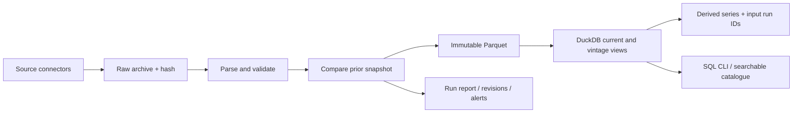

# Commodity Data Platform

Project 1 of the commodity research portfolio. Release **0.2** ingests seven public
sources, versions them as immutable Parquet snapshots, queries them through DuckDB,
and materializes 14 derived series with input lineage. Local verification on
7 October 2026: **262,591 current observations, 13,147 series**, including derived data.

**The full original Project 1 is not complete.** A current dated WTI contract and its
first-notice/last-trade metadata are now available, but an official settlement feed and
verified exchange calendar are still needed; GitHub scheduling/off-device backups are inactive.
See [completion gates](docs/COMPLETION.md). No synthetic data are mixed into the
live catalogue. This is a local library and CLI, with a searchable HTML export.

## Run

Requires Python 3.11+ and uv. From this directory:

```sh
uv sync --frozen --extra dev
make check
uv run commodity-data refresh
uv run commodity-data health
uv run commodity-data export-catalog output/catalog.html
uv run commodity-data query "SELECT date, value, unit FROM observations WHERE source = 'worldbank' AND series = 'Copper' ORDER BY date DESC LIMIT 12"
```

Open `output/catalog.html` in a browser. It is a static, searchable snapshot; run
export again after a refresh. SQL queries are a trusted local analyst interface,
not an untrusted web SQL service.

## Source coverage

| Adapter | Live coverage verified | Status |
| --- | --- | --- |
| `worldbank` | 71 monthly benchmark series; Jan 1960-Sep 2026 | Working |
| `eia-public` | Four daily spot series, weekly crude stocks/production, two historical WTI futures ranks; 60,924 observations | Working without API key |
| `westmetall` | Cash, three-month and stocks for copper, aluminium, nickel, zinc, lead and tin; 2020-6 Oct 2026 | Working; 18 series |
| `cftc` | Disaggregated futures-only: open interest and managed-money longs/shorts for 11 markets; Jun 2006-Sep 2026 | Working; 33 series |
| `agsi` | EU aggregate storage, capacity, fill, injection and withdrawal since 2020 | Implemented/fixture-tested; live key required |
| `usda-wasde` | 35,194 point-in-time estimates from seven original CSVs; 10 Mar-11 Sep 2026 | Working from locally supplied official files |
| `yahoo-futures` | Dated NYMEX WTI contracts, backed by Futures Clock FND/LTD metadata | Working; daily closes, **not** official settlement prices |
| `eia` | Optional API route for WTI/Brent spot | Fixture-tested; own key required |

`refresh` downloads the public web sources and derives series. It includes AGSI
when `AGSI_API_KEY` is set. WASDE files are deliberately a separate local import
because USDA blocks unattended downloads in this environment:

```sh
uv run commodity-data ingest usda-wasde --files /path/to/oce-wasde-report-data-*.csv
```

A successful refresh does **not** mean all completion gates have passed.

Use `commodity-data ingest <adapter>` for individual sources. The public EIA route
means an EIA API key is no longer necessary for the default pipeline. Keep optional
`EIA_API_KEY` and `AGSI_API_KEY` in environment variables or repository secrets;
`.env` is ignored by Git and is not loaded automatically.

CFTC market codes: 067651, 023651, 111659, 022651, 085692, 088691, 084691, 002602,
005602, 001602, 073732. Original market names, contract units and report-family fields
are preserved in raw JSON. Normalized values are contract counts, not notional
exposures. COT observation dates describe positions as of that date; do not trade
on them before actual publication. Historical release timestamps are not inferred.

## Architecture



DuckDB queries Parquet rather than duplicating the observation store. Raw files,
normalized snapshots and run manifests are sufficient to rebuild the database.

```
data/
  raw/<sha256>.<extension>      # source bytes; ZIP bundles for multiple downloads
  parquet/<run_id>.parquet     # complete normalized source snapshot
  runs/<run_id>.json           # provenance, changes, alerts, derived lineage
  catalog.duckdb              # rebuildable views
  health.json                 # most recent full refresh summary
```

Rows contain `source`, `series`, `date`, `value`, `unit`, `frequency`, `kind`,
`retrieved_at`, `run_id`, `source_sha256`. Monthly World Bank dates are month-end.
Provider identifiers are retained; a provider renaming a series requires an explicit
schema migration. There is no cross-provider instrument master yet.

`observations` selects one latest successful snapshot per source. `vintages` contains
all successful snapshots, including unchanged retrievals and revisions. `catalog`
provides metadata and coverage. Retrieval time is when this pipeline saw a download,
not its original publication time. Vintage history starts with our first run.

Choose a complete source snapshot for an as-of query, rather than combining rows
from several historical snapshots:

```sql
WITH eligible AS (
 SELECT *, dense_rank() OVER (
   PARTITION BY source ORDER BY retrieved_at DESC, run_id DESC
 ) AS snapshot_rank
 FROM vintages
 WHERE retrieved_at <= TIMESTAMPTZ '2026-10-08 00:00:00+00'
)
SELECT * EXCLUDE (snapshot_rank) FROM eligible WHERE snapshot_rank = 1;
```

## Reliability and monitoring

- A file lock serializes writers. Raw, Parquet and manifest files use temporary
  files and rename; DuckDB view changes use a transaction.
- Invalid values, duplicate keys, future dates, inconsistent metadata, disappearing
  history/series and changed units are rejected before a new snapshot is promoted.
- Revision reports count added/revised observations and retain a sample of changes.
- Downloads retry throttling/server errors with bounded backoff; transport connection
  retries are also enabled. Credential-bearing HTTP messages are not printed.
- Staleness limits: daily seven calendar days, weekly 14, monthly 65. Internal gap
  thresholds are heuristic; source-specific holiday/release schedules remain a
  production-hardening task. Discontinued EIA futures ranks are explicitly exempt
  from freshness expectations.
- Outlier flags use an absolute relative change above 50%. These are review prompts,
  particularly for signed spreads near zero, not a cleaning rule. Values are never
  forward-filled or deleted just because they are unusual.
- Full-history alerts remain in the report. New alert evidence is deduplicated by
  series/check/affected dates, so a new anomaly in an already-flagged series can still
  alert. No arbitrary exceptions for discontinued World Bank series have been approved.

An individual `ingest --strict` exits 2 on review alerts; ingestion failures exit 1.
The daily workflow warns on new alerts and fails for failed source attempts. Email
or messaging delivery is not configured; GitHub notification preferences govern
workflow-failure notifications. A process crash may leave an unused temporary file;
rebuild only follows successful manifests. No unattended service is running locally.

## Derived data

Run `commodity-data derive` after individual source refreshes. The full `refresh`
command also does this. Derived manifests identify the input source run IDs and
method `derived-v1`; the raw derived bundle retains the selected input observations.

- Six LME cash-minus-three-month spreads, in USD/tonne.
- Six relative slopes `(three_month - cash) / cash`, dimensionless and **not**
  annualized. Nonpositive cash prices are excluded from this ratio.
- Indicative 3:2:1 **spot** crack: `(2*42*gasoline + 42*heating_oil - 3*WTI)/3`.
  Gasoline/heating oil are New York Harbor spot and WTI is Cushing; this is an
  indicative cross-location measure, not an executable refinery margin or RBOB future.
- Historical WTI futures rank 1 minus rank 2, ending April 2024. Rank series do not
  identify held contracts and are not a substitute for individual-contract histories.

All inputs join on exact observation dates, with no fills. Unit mismatches fail.
Different source refresh times are disclosed by lineage; inspect source health
before using derived results when a source refresh has failed.

## Futures rolls

```sh
uv run commodity-data continuous examples/contracts.csv --roll-days 5
# For a real CSV, after obtaining verified metadata and holiday closures:
uv run commodity-data continuous my-contracts.csv --roll-days 3 --basis business --holidays closures.txt --adjustment additive
```

Input: `date,contract,expiry,settle`, optional `first_notice`; one market, currency and
price unit only. Calendar basis uses calendar-day offsets. Business basis uses
weekdays plus explicit `YYYY-MM-DD` closures and rejects missing/unexpected sessions.
First-notice, when supplied, constrains the cutoff to the earlier of notice/expiry.
A new contract is entered at the roll-day close; the outgoing contract determines
that day's price change. Missing scheduled/outgoing quotes fail rather than causing
a silent contract substitution. `--adjustment none` retains raw selected prices;
`additive` applies backward adjustment to `continuous_price`.

Synthetic demonstration: outgoing contract 70 to 71, incoming 76. Earned price
change is 1; roll gap 5 is not profit. Back-adjusted history is revised by future
rolls. Use `held_change` with actual holdings, multipliers, FX and costs for later
P&L work; percentage returns on adjusted levels are not investable returns.
The `annualized_slope` primitive is available for actual known tenors and positive
prices. It is not used to invent exact maturities for published LME three-month data.

## Backup and hosted scheduling

```sh
uv run commodity-data backup backups/project1.zip
uv run commodity-data --data-dir /path/to/empty-restored-directory restore backups/project1.zip
```

Archives include raw files, run manifests and Parquet, plus SHA-256 checksums.
Restore verifies paths/checksums before writing and refuses a nonempty destination.
The local restore test recovered all 214,850 observations. A backup in this folder
is still on the same device; copy it to durable storage you control.

`.github/workflows/ci.yml` runs tests/lint/types. `daily.yml` requests a daily 18:25
UTC refresh, restores the latest unexpired cumulative artifact, refreshes sources,
exports the catalogue and uploads the archive even when a refresh fails.
**The workflows are inactive until this project is pushed to a GitHub repository.**
No remote exists and no repository has been published. Schedules are best effort.
Artifacts expire after 90 days: a continuing daily chain carries older vintages
forward, but a long outage can lose the archive. Durable off-device backup and a
verified hosted run are still required for completion.

## Verification and project note

`make check` runs Ruff, mypy and pytest. Tests use synthetic fixtures and do not
require network access. Live checks verified four source downloads, repeat refresh,
derived lineage, full archive/restore and catalogue search in Chrome.

Reproduce the two-page note:

```sh
uv sync --frozen --all-extras
uv run --extra reports python scripts/build_note.py
```

Output: `output/pdf/project-1-engineering-note.pdf`. Generated data, catalogues,
backups and PDFs are ignored by Git. Raw vendor data are not shipped with the code.
Keep local analysis distinct from redistribution; provider terms still apply.

Read [completion gates](docs/COMPLETION.md), [portfolio roadmap](docs/ROADMAP.md)
and [the introductory walkthrough](docs/WALKTHROUGH.md).

## Primary sources

- [World Bank commodity markets](https://www.worldbank.org/en/research/commodity-markets)
- [EIA petroleum data](https://www.eia.gov/dnav/pet/)
- [EIA futures discontinuation notice](https://www.eia.gov/dnav/pet/PET_PRI_FUT_S1_W.htm)
- [CFTC disaggregated futures-only dataset](https://publicreporting.cftc.gov/resource/72hh-3qpy.json)
- [Westmetall data](https://www.westmetall.com/en/markdaten.php?action=table&field=LME_Cu_cash)
- [AGSI API documentation](https://www.gie.eu/transparency-platform/GIE_API_documentation_v006.pdf)
- [USDA historical WASDE](https://www.usda.gov/historical-wasde-report-data-3)
